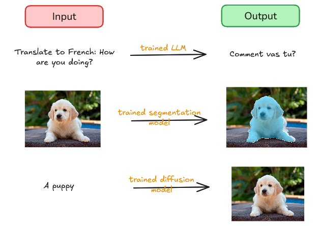

This course is a quantitative, systems-oriented deep dive into LLM inference. *Inference* is the process of giving a ML model an input and obtaining an output.

We use the term *serving* when talking about inference for several concurrent users. This also refers to a software stack that accepts user requests, schedules them, and executes inference.

## Why Focus on LLM Inference?

There are two reasons motivating our study of the LLM process in depth in our course:

### Scaling of usage

With widespread adoption of AI, the LLM inference workload has become a significant chunk of overall AI compute. There are two factors driving this rapid increase in inference compute:

1. Number of users - growing as more people make increasing use of AI models
2. Inference scaling - our interactions with LLMs these days does not resemble the one prompt, one response patter anymore.

a. Longer - reasoning models generate a lot of reasoning tokens before they answer
b. Wider - on difficult problems, test-time scaling is used. This involves sampling many candidate answers and picking the best one(s) as decided by a verifier
c. Deeper - agentic systems solve a complex task by repeatedly acting, observing, and adapting. Each step involves making LLM inference calls.

 
### Computational challenges

LLM inference poses special computational challenges that are distinct from training.

1. The autoregressive nature of transformers means LLMs generate response token-by-token. This makes it harder to parallelize inference as compared to training.

2. As we discuss later in the course, inference comprises two phases - prefill (processing prompt and generation of first token) and decode (generation of subsequent tokens). The two phases have very different computational characteristics.

3. Previously it was sufficient to generate tokens at human reading speed. With the rise of reasoning and agentic models, the latency requirements for LLM deployment has become so tight that one is often operating at the limits of hardware.

4. Our interactions have become long-context. Think about asking the LLM about a large codebase. Such long context ultimately place a lot of demand on constrained GPU memory in terms of both capacity and bandwidth. 

5. Capable models today have parameters numbering hundreds of billions or even a few trillions. Such large models need to be sharded over multiple GPUs - this introduces additional communication costs that make it even harder to produce tokens at low latency.

## A Puzzle

Let us give a prompt of 128 tokens to a Qwen3-8B model running on A100 GPU and measure the inter-token latency (ITL). We use FP16 for both weights and activations. , we measure decode latency as 34.86ms on average . What is our expected number?

The number of FLOPs done by the GPU can be approximated by 2 * (num of parameters) = 2 * (8.2 * 1e9) FLOPs = 16.4 GFLOPs
We'll derive this thumb rule in the next lecture. Note how the number of FLOPs does not depend on the sequence len - we'll see this is characteristic of the decode process as opposed to prefill. Qwen3-8B actually has 8.2B parameters.

If we look at the spec sheet of A100, we see its peak compute throughput is 312 TFLOPS (for dense matrix multiplication on FP16 tensor cores). If we fully saturated compute, the decode latency would have been 0.05ms. Another way of saying this is that we're using compute at 
0.05/34.86 = 0.15% efficiency. 
By FLOPS, we denote the compute throughput unit FLOPs/sec. 

That sounds terrible. It maybe that the memory bandwidth is being saturated. Since GPUs can typically do computations much faster than memory transfer (we'll elaborate upon this in subsequent lectures), that would explain the large latency. Let's verify if this is the case.

During a decode step, we transfer weights, KV cache and activations from GPU's RAM to its compute units. At this context len, the transfer is heavily dominated by the weights, so we'll use that for our calculations. We moved 8.2 * 1e9 * 2 bytes = 16.38 GB in 34.86ms (inter-token latency). That gives us achieved bandwidth of (16.38/34.86)*1e3 GB/s = 469.88 GB/s. The peak bandwidth of our A100 is 1555 GB/s. So in effect, we used 469.88/1555 = 30.2% of peak bandwidth.

So neither compute nor memory bandwidth is the limiting factor! We can now appreciate:

1. The compute utilization, the metric we care about when using the GPU, is very low during inference.
2. There is a bottleneck that is neither GPU compute nor memory bandwidth.

As part of our course, we're going to investigate more deeply what's going on and do our best to improve GPU utilization.

