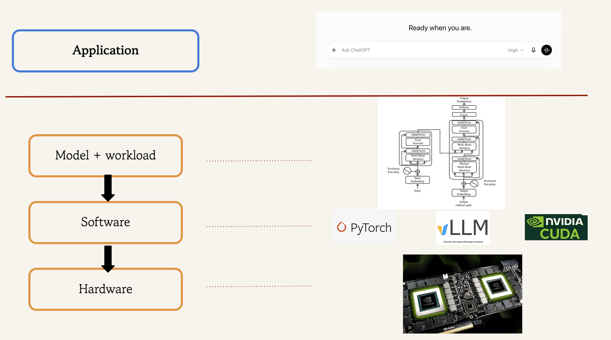
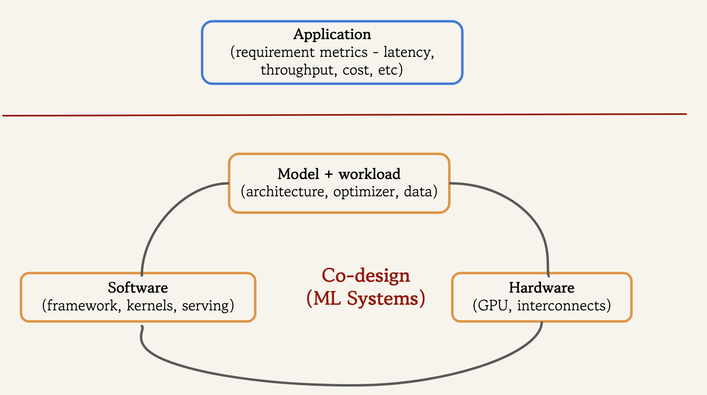

This course is a quantitative, systems-oriented deep dive into LLM inference. *Inference* is the process of giving an ML model an input and obtaining an output.

::: {.intro-figure}

:::

We use the term *serving* when talking about inference for several concurrent users. This also refers to a software stack that accepts user requests, schedules them, and executes inference.

## Why Focus on LLM Inference?

There are two reasons for studying LLM inference in depth:

### Scaling of usage

With widespread adoption of AI, LLM inference has become a significant computational workload. For example, Google has [reported](https://blog.google/innovation-and-ai/sundar-pichai-io-2026/) that its monthly inference workload grew from 9.7T tokens in May 2024 to ~480T tokens in May 2025 to ~3.2Q (quadrillion) tokens in May 2026. 

There are two factors driving this rapid increase in inference compute:

1. Number of users - more people are using AI models, and using them more frequently. 
2. Inference scaling - a task no longer necessarily consists of one prompt followed by one response. 
    a. Longer - reasoning models generate a lot of reasoning tokens before they answer
    b. Wider - on difficult problems, test-time scaling is used; for example, sampling multiple candidate answers and using a verifier to select the best.
    c. Deeper - agentic systems solve a complex task by repeatedly acting, observing, and adapting. Each step involves making LLM inference calls.

### Computational challenges

LLM inference poses special computational challenges that are distinct from training.

1. The autoregressive nature of transformers means LLMs generate response token-by-token. This makes it harder to parallelize inference than training. ^[Actually, the lack of parallelism is for the decode inference steps. The generation of first token (prefill) usually has adequate parallelism]

2. As we discuss in a later lecture, inference comprises two phases - prefill (processing the prompt and generating the first token) and decode (generation of subsequent tokens). The two phases have very different computational characteristics.

3. Earlier interactive applications (simple chatbots) mainly needed to generate tokens at human reading speed. With reasoning and agentic models, generated tokens can lie on the critical path of a larger computation, making the token-generation latency requirements much tighter. 

4. Our interactions have become long-context. Think about asking the LLM about a large codebase. Such long contexts place heavy demands on limited GPU memory, both in capacity and bandwidth. 

5. Capable models today can have hundreds of billions or even trillions of parameters. Such large models need to be sharded across multiple GPUs, introducing communication costs that make low-latency generation harder. 

## A Puzzle 

Let us give a prompt of 128 tokens to a Qwen3-8B model running on an A100 GPU and measure the inter-token latency (ITL). We use BF16 for both weights and activations. Using PyTorch timing, we measure decode latency as 34.9 ms per token on average. The token generation throughput is 28.7 tokens/s. What is the simplest latency estimate we can make? 

The 8.2B parameter Qwen3-8B model does approximately 2 * (num of parameters) = 2 * (8.2 * 1e9) FLOPs = 16.4 GFLOPs per generated token. (We'll derive this thumb rule later).

The [A100](https://www.nvidia.com/content/dam/en-zz/Solutions/Data-Center/a100/pdf/nvidia-a100-datasheet-nvidia-us-2188504-web.pdf) has a peak compute throughput as 312 TFLOPs/s (dense matrix multiplication, BF16/FP16 Tensor Cores). 16.4 GFLOPs / 312 TFLOPs/s gives 0.05 ms. Hence, we observe a discrepancy by a factor of ~700x.

Clearly, peak FLOPs alone is the wrong model for this workload. Why? One of our objectives is to learn enough systems concepts to reason about discrepancies such as this. 

## Efficiency is Key

GPUs are expensive and power-hungry, so hardware efficiency directly affects the cost and power consumption of ML workloads. This becomes more critical when training or deploying models at scale. ML Systems gives us the concepts and tools with which to investigate computational bottlenecks and address them.

## What is ML Systems?

A common mental model for building an ML application is:

(a) decide on the model architecture and source the training data
(b) write training code in PyTorch, which in turn uses optimized GPU libraries
(c) run the training process on the hardware - a computer with an ML accelerator such as a GPU.

::: {.intro-figure}

:::

This model is adequate for small, working prototypes. At scale however, where both cost and application requirements matter, the picture becomes more complicated:

::: {.intro-figure}

:::

(a) the application requirements now specify metrics like LLM serving throughput and token generation latency 
(b) the design of the model itself considers how it can make efficient use of the hardware 
    -   e.g., by having more parallelism.
(c) the software stack is also designed with the specific hardware in mind 
    -   e.g., cuBLAS provides different matmul implementations for A100 and H100 GPUs.
    -   e.g., FlashAttention-3 is specific to Hopper GPU architectures and FlashAttention-4 to Blackwell architectures.

For our purposes, ML Systems is the study of how models and workloads, software stacks, and hardware interact to meet model serving requirements such as throughput, latency, and cost.^[ML Systems is actually a much broader field concerned with the systems required to build and run machine learning models and applications, including aspects like training infrastructure, fault tolerance, deployment, and monitoring. Here we study it through one particularly important setting of efficient LLM inference on GPUs. To see the broader lay of the land, browse the recent proceedings of conferences such as [MLSys](https://proceedings.mlsys.org/paper_files/paper/2026) and [OSDI](https://www.usenix.org/conference/osdi26/technical-sessions).]

## Why Study ML Systems?

1. Systems constraints determine what model architectures and workloads are practical: 
    - FlashAttention: makes long-context inference practical by reducing memory traffic during attention.
    - Mixture-of-expert (MoE) models: requires efficient routing, communication, and expert-parallel execution to realize its computational advantage. 
    - Continuous batching + KV paging: makes high-concurrency serving possible. 

2. One can take a principled approach to make performance estimates, measure quantities experimentally, locate bottlenecks using profilers and form hypotheses about possible improvements.

3. ML Systems concepts are more durable and apply even when the AI models and hardware they run on are evolving rapidly. ^[Eric Auld expresses this point neatly in his [post](https://ericauld.github.io/2025/03/04/math-to-gpu.html)]

Returning to our puzzle, the rest of the course will develop the tools and concepts needed to explain where those 34.9ms per token actually go, and what can be done to reduce it.

