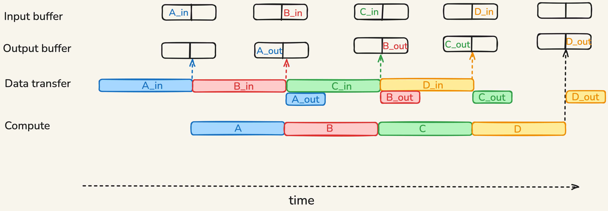
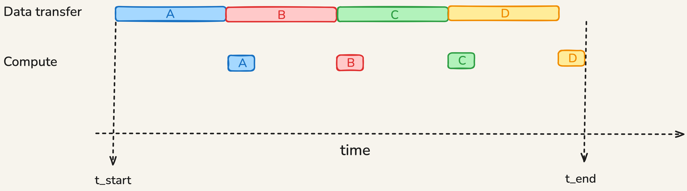
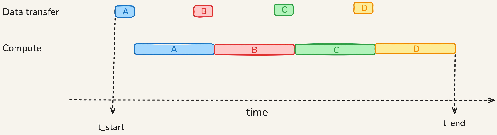
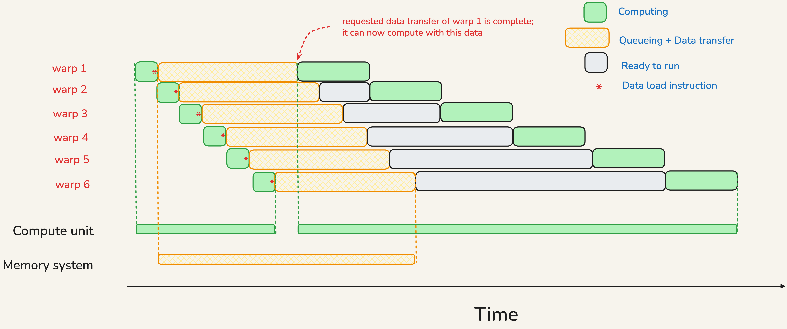
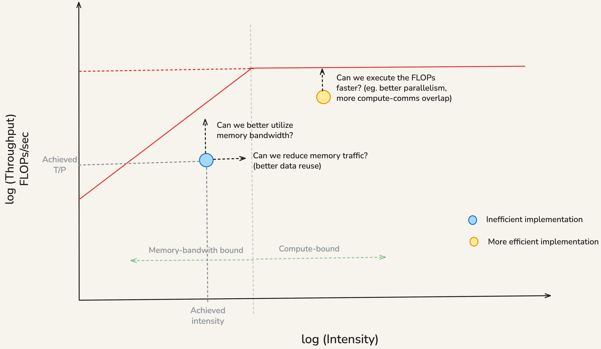

The [All About Rooflines](https://jax-ml.github.io/scaling-book/roofline/#visualizing-rooflines) chapter of the Scaling book provides a good discussion of the roofline model. This writeup expands upon it and discusses a few concepts in more detail.

## Overlap of Computation and Communication

Consider a computational task comprised of 4 indepedent chunks of work A, B, C, and D. Chunks are independent in the sense that there is no data dependency - the input of a chunk does not depend on the output of any other chunk. Before a chunk can execute, it must wait for its input data to be available in a local buffer. When a chunk is executing, the machine can transfer the input data needed for the next chunk as well as the output data of the previous chunk. In doing so, we must be careful to not overwrite the input or output data of the currently executing chunk. 

Let us first assume that the transfer time of input data of a chunk is the same as its execution time. In this case, the following diagram illustrates how computation and communication can be overlapped:

{width=99%}

Note how the two partitions of the input buffer prevent the input data of currently executing chunk from being overwritten by the input data of the next chunk; the double buffering of the output serves the same purpose. 

For a memory-bound workload, the compute time of a chunk is more than the transfer time of its input data. The following diagram shows this scenario:

{width=99%}

On the other hand, for a compute-bound workload, the compute time of a chunk is less than the transfer time of its input data:

{width=99%}

Once the pipeline is running, the time per chunk is the maximum of the compute time and the transfer time of its input data. When there are a lot of chunks, the time taken to fill and drain the pipeline is relatively small. Hence, we can approximately write

$T_{total} \approx max(T_{compute}, T_{transfer})$

where $T_{compute}$ is the total compute time summed up across all chunks and $T_{transfer}$ is the total transfer time summed up across all chunks.

### How GPU Achieves Overlap

The following subsections make use of terms that we will be discussed in later lectures. So one may return here after covering those topics. 

#### Warp Oversubscription

GPUs accommodate a lot of warps because they help in hiding the long latency of global memory accesses. When the load request of a warp is being serviced, the warp scheduler can issue arithmetic instructions from another warp whose inputs are ready.

In the following schematic, we have 6 warps issuing load requests to memory. When the load request of a warp is being serviced, the warp scheduler issues arithmetic instructions from other warps.   

{width=99%}

The hardware automatically achieves this overlap by scheduling a ready-to-run warp when the load request of a warp is being serviced. As programmer, we need to ensure that there are several warps on each SM for this to work.

#### Tile Prefetching and Pipelining

Some computations can be decomposed into smaller problems by partitioning the input tensor into tiles. The output can then be computed tile by tile. The kernel issues transfers from global memory to shared memory early, then performs computation on an already available tile. Data transfer can happen in the background while the current compute units are busy. 

The CUDA runtime does not automatically transform a basic tiled loop into this pipeline. The kernel author has to arrange the buffers, early copies, and synchronization.

## Roofline Analysis

### Roofline Plot

$\text{Arithmetic Intensity} = \frac{\text{Computation FLOPs}}{\text{Bytes transferred}}$

Let us divide the numerator and denominator by the total time taken to execute the workload. We get

$\text{Arithmetic Intensity} = \frac{\text{Achieved Compute Throughput (FLOPs/sec)}}{\text{Achieved Memory Bandwidth (Bytes/sec)}}$

If we take logarithm of both sides, we get

$\log(\text{Achieved Compute Throughput}) = \log(\text{Intensity}) + \log(\text{Achieved Memory Bandwidth})$

We can upper bound the achieved compute throughput by replacing the achieved memory bandwidth with the peak memory bandwidth. We get

$\log(\text{Achieved Compute Throughput}) \leq \log(\text{Intensity}) + \log(\text{Peak Memory Bandwidth})$

Knowing that the peak compute throughput is an upper bound on the achieved compute throughput, we can refine our inequality to get

$\log(\text{Achieved Throughput}) \leq \min(\log(\text{Peak  Throughput}), \log(\text{Intensity}) + \log(\text{Peak B/W}))$

The values of $\log(\text{Peak Throughput})$ and $\log(\text{Peak Bandwidth})$ depend on which compute unit and memory subsystem we are considering:

**Peak throughput** - Are we running computation on Tensor Cores or CUDA Cores? What are the data types of operands?

**Peak bandwidth** - Are we focusing on data coming from global memory or L1 or L2 caches? 

### Achieved Intensity and Throughput

In the [Roofline chapter](https://jax-ml.github.io/scaling-book/roofline/) of the Scaling book, we computed ideal value of arithmetic intensity:

$\text{Ideal Intensity} = \frac{\text{Useful Maths FLOPs}}{\text{Minimum Bytes Transferred}}$

The FLOPs we consider are the useful arithmetic operations that are required to compute the output. An implementation may perform additional FLOPs due to a variety of reasons. The bytes transferred assumed that once we load a piece of data, we can reuse it as many times as needed. In practice, the limited size of on-chip memory means such perfect reuse is not feasible. Despite these limitations, the ideal arithmetic intensity provides a good starting estimate.

In practice, to place an implementation by a point on the roofline plot, we need to measure the achieved arithmetic intensity and achieved throughput. We collect three measurements using a profiler when running the kernel: 

(a) execution time, 
(b) total number of FLOPs performed, and
(c) total number of bytes transferred (considering both reads and writes). ^[Note that bytes transfer data should correspond from and to the memory subsystem we are considering.]

From these we can derive:

$\text{Achieved Intensity} = \frac{\text{Total FLOPs}}{\text{Total Bytes Transferred}}$

$\text{Achieved Throughput} = \frac{\text{Total FLOPs}}{\text{Execution Time}}$

These let us place a point corresponding to the implementation on the roofline plot. The location of this point informs us of the kind of kernel optimizations we should be targeting. The following figure explains this:

{width=99%} 

When we seek to improve bandwidth utilization, one metric becomes useful to look at:

$\text{Achieved Bandwidth} = \frac{\text{Total Bytes Transferred}}{\text{Execution Time}}$

### Matmul Kernel Example

As a concrete example, consider a kernel multiplying two 4096 by 4096 matrices in FP32. We'll run this kernel on CUDA cores (not Tensor cores) on a A10 GPU for simplicity. We consider three implementations:

1. a [naive version](https://gist.github.com/pankajpansari/246e12261c30bb23de4416f88369db70) that does not use shared memory creating lots of redundant global memory accesses,

2. a more [optimized version](https://gist.github.com/pankajpansari/b96de390d5b39caee3399e83b3e9d2af) where threads in a block cooperate by loading data into shared memory, thereby decreasing read requests, and

3. cuBLAS implementation, configured to use ordinary FP32 arithmetic; highly optimized by kernel engineers.

For each, we collect the execution time, total FLOPs performed, and total bytes transferred to/from global memory using Nsight Compute.  

![**Figure**: Roofline figure for an A10 GPU with (achieved intensity, achieved throughput) of 3 FP32 matmul implementations plotted.^[A10 has an advertised peak FP32 throughput of 31.24 TFLOPs/sec at maximum clock frequency of 1.7GHz. However, the profiler ran at clock frequency of 885 MHz and the peak FP32 throughput available at this frequency was 16.31 TFLOPs/sec, so we report this for a fair comparison.]](a10_roofline.png){width=99%}

The measurements are summarized in the following table:

| Metric | Naive | Shared-memory tiled | cuBLAS FP32 |
|:--|--:|--:|--:|
| Execution time (ms) | 135.1 | 118.0 | 11.6 |
| FP32 operation count (GFLOP) | 137.4 | 137.4 | 137.5 |
| Total DRAM traffic (GB) | 43.9 | 10.5 | 1.1 |
| Arithmetic intensity (FLOP/byte) | 3.1 | 13.0 | 124.4 |
| Achieved throughput (TFLOP/s) | 1.0 | 1.2 | 11.8 |
| Achieved DRAM bandwidth (GB/s) | 324.8 | 89.4 | 95.1 |

: Recorded measurements for FP32 multiplication of two 4096 by 4096 matrices on an A10 GPU. {#tbl-matmul-measurements}

We notice that all three implementations do almost the same arithmetic FLOPs. The shared-memory optimized version makes better reuse of data read from global memory (fewer total DRAM traffic), hence it shifts mostly to the right of the naive version. The cuBLAS implementation further greatly reduces the DRAM traffic and adds other optimizations to bring both achieved compute throughput and bandwidth closer to their peak values.