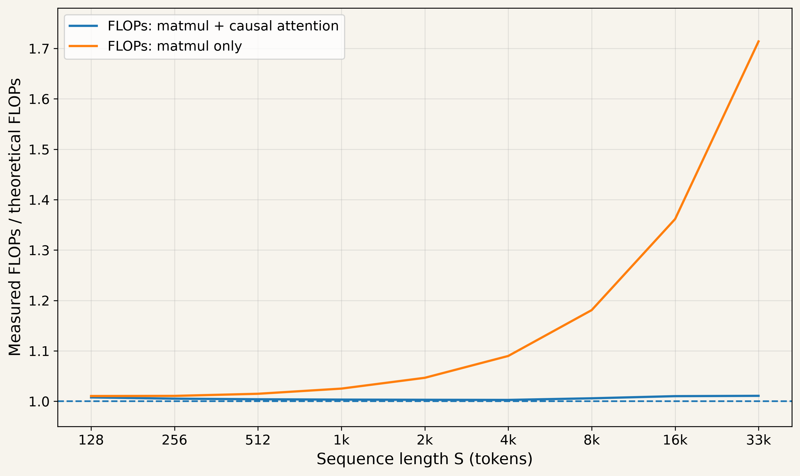

In this writeup, we'll calculate the number of FLOPs performed during a Transformer forward pass over a single sequence of $S$ tokens. Our treatment here closely follows the [Transformer Accounting](https://jax-ml.github.io/scaling-book/transformers/) chapter of the Scaling book, but focuses on the forward pass and uses a simpler architecture. ^[We consider vanilla MHA, not GQA; we also assume vanilla FFN, rather than gating einsum.] In case you need to brush up on Transformer details, please refer to [this blog post](https://jalammar.github.io/illustrated-transformer/) and [this book chapter](https://web.stanford.edu/~jurafsky/slp3/7.pdf).

## Preliminaries

1. Dot product $x[P].y[P]$ needs $P$ multiplies and $P - 1$ additions; hence we do $2P - 1$ FLOPs in total. We can approximate this as $2P$ FLOPs when $P$ is large; henceforth, we'll assume this.

2. A matrix-vector product $A[N, P]x[P]$ involves doing $N$ dot products - one per row of A. In total, $2NP$ FLOPs are needed.

3. A matrix-matrix product $A[N, P]B[P, M]$ gives an output of shape $[N, M]$. Element $(i, j)$ is obtained by doing a dot product between the $i$-th row of $A$ and the $j$-th column of $B$. In total, we do $2NPM$ FLOPs. We say that $P$ is the *contracting* dimension, since we sum up over this dimension when doing the dot product. This gives us a useful rule of thumb:

\begin{equation}
[N, P] \times [P, M] \to [N, M]: 2NPM \text{ FLOPs}.
\end{equation}

4. Sometimes we repeat an operation independently for every element of some dimension. For example, consider multiplying two tensors $A[K, N, P]$ and $B[K, P, M]$ in the following manner
\begin{equation}
out(k, n, m) = \sum_{p} A[k, n, p]B[k, p, m].
\end{equation}
In this case, the total FLOP count is $K$ times $2NPM$, that is, $2KNPM$ FLOPs. 

::: {.intro-figure}
.](transformer_arch.png){width=99%}
:::

## FLOPs and Parameter Counts 

We'll calculate FLOPs for a forward pass through one Transformer layer and multiply that value by $L$, the number of layers in the model. We also need to account for the embedding and unembedding operations at the very start and end respectively.

As a first approximation, we can the ignore the contribution of ReLU, layer normalization, and softmax to the total FLOPs count. These operations require relatively few FLOPs per element, so their contribution is much smaller than that of tensor multiplications.

### MLPs
\begin{array}{ccc}
\textrm{operation} & \textrm{FLOPs} & \textrm{params} \\
\hline \\

A[S,D] \cdot W_{\mathrm{in}}[D,F]
    & 2SDF & DF \\[10pt]

A[S,F] \cdot W_{\mathrm{out}}[F,D]
    & 2SDF & DF \\[10pt]

\hline \\
& 4SDF & 2DF
\end{array}

### Attention 

#### Linear Projections
\begin{array}{ccc}
\textrm{operation} & \textrm{FLOPs} & \textrm{params} \\
\hline \\

A[S,D] \cdot W_Q[D,N,H]
    & 2SDNH & DNH \\[10pt]

A[S,D] \cdot W_K[D,N,H]
    & 2SDNH & DNH \\[10pt]

A[S,D] \cdot W_V[D,N,H]
    & 2SDNH & DNH \\[10pt]

A[S,N,H] \cdot W_O[N,H,D]
    & 2SDNH & DNH \\[10pt]

\hline \\
& 8SDNH & 4DNH
\end{array}

#### Scaled Dot product Attention (SDPA)
SDPA involves repeating the SH.HS matmul over $N$ heads to get similarity scores, and then repeating the SS.SH matmul over the $N$ heads to get attention-weighted values. In autoregressive inference, a token attends only to the tokens coming before it in the sequence. The attention matrix is lower-triangular and efficient attention kernels, such as FlashAttention, approximately halve the number of query-key pairs.

\begin{array}{cc}
\textrm{operation} & \textrm{FLOPs} \\
\hline \\[3pt]

Q[S,N,H] \cdot K[S,N,H]
    & {S^2}NH \\[3pt]

A[S,S,N] \cdot V[S,N,H]
    & S^2NH \\[3pt]

\hline \\
& \approx 2S^2NH
\end{array}

### Other Operations
It remains for us to consider the embedding and unembedding layers. 

Conceptually, embedding a token is equivalent to multiplying its $V$-dimensional one-hot representation by a $[V, D]$ embedding matrix. In practice, this is implemented as a lookup of the appropriate row of the embedding matrix. This involves only a memory operation and no arithmetic.

The unembedding layer comes after the last Transformer layer and, in general, computes logits for all the tokens in the sequence. The number of FLOPs involved is:

\begin{array}{ccc}
\textrm{operation} & \textrm{FLOPs} & \textrm{params} \\
\hline \\
A[S,D] \cdot W_{\mathrm{unembed}}[D,V]
    & 2SDV & DV
\end{array}

Next token generation requires logits only for the last token in the sequence. In this case, the FLOPs count is $2DV$ instead of $2SDV$. Whether the forward pass computes all logits or only last token's logits depends on the implementation.

### Attention FLOPs vs Linear-layer FLOPs

For our analysis, we are going to assume $NH = D$ and $F = 4D$ - this is very commonly the case in Transformers. Summing up attention FLOPs over all layers, we get:

\begin{equation}
\text{Total Attention FLOPs} = 2S^2NHL = 2S^2DL
\end{equation}

Summing up the linear projection FLOPs over all layers (not including unembedding layer):

\begin{equation}
\text{Total linear projection FLOPs} = (4SDF + 8SDNH)L = 24SD^2L
\end{equation}

The ratio of attention FLOPs to all linear-layer FLOPs (including attention projections) is:

\begin{equation}
\frac{\text{Attention FLOPs}}{\text{Linear projection FLOPs}} = \frac{2S^2D}{24SD^2} = \frac{S}{12D}
\end{equation}

Plotting this ratio for typical values of D gives

::: {.intro-figure}
{width=70%}
:::

From the plot we observe that the attention FLOPs dominate the linear projection FLOPs at longer context lengths. The crossover happens at sequence lengths ~24k, ~49k, and ~98k for embedding dimensions 2k, 4k, and 8k respectively. Larger models tend to have larger embedding dimensions.

### General Rule of Thumb for Transformer Inference FLOPs

The total number of parameters involved in linear projections (excluding the embedding and unembedding matrices) is approximately
\begin{equation}
P_{linear} = (2DF + 4DNH)L = 12D^2L
\end{equation}

For the short-context regime ($S << 12D$), the quadratic attention FLOPs are small relative to linear projection FLOPs. Ignoring lower-order operations like layer norm, ReLU, softmax, we arrive at the useful thumb rule:
\begin{equation}
\text{Forward-pass FLOPs} = 2 \times \text{num tokens } \times P_{linear}
\end{equation}
(Unembedding matmul with $2SDV$ FLOPs and $DV$ parameters also follows the same thumb rule.)^[The thumb rule is sometimes written as $2 \times \text{num tokens } \times P$, where $P$ is the total number of parameters. This is convenient but introduces error. For example, for Qwen3-8B out of 8.18B total parameters, 622M are in the embedding matrix. This overestimates FLOPs by ~8.2%.]

In effect, each weight parameter participates in one multiply and one add (that is, one fused-multiply-add) per token.

### Profiling FLOPs Count for Qwen3-8B Forward Pass

Let us evaluate how accurate FLOPs count estimates are by profiling forward pass on a Qwen3-8B model running in BF16 precision on the H100 GPU. Qwen3-8B uses grouped multi-query attention (GQA) rather than MHA considered here; also, its MLP uses gating einsum. We refer to the [Transformer Accounting](https://jax-ml.github.io/scaling-book/transformers/) chapter of the Scaling book for details on how that changes the FLOPs estimate. FlashAttention-2 was used as the attention backend. Only the logits for the last token was generated, so we account $2DV$ FLOPs for the unembedding layer. We vary the sequence lengths and for each len, we collect the number of BF16 FLOPs performed by the Tensor Cores using Nsight Compute. ^[Ideally BF16 FLOPs of ordinary CUDA Cores (non-matmul ops) should also be collected. This results in large profiling overhead due Nsight Compute replays, so we avoided collecting them.]

::: {.intro-figure}
{width=70%}
:::

We observe that our estimate incorporating attention FLOPs is accurate with respect to Tensor Core FLOPs (does matmul operations) to within 2% even at large sequence length. On the other hand, considering only linear projection FLOPs gives estimates within roughly 10% up to about 4k sequence length, beyond which the error grows rapidly.