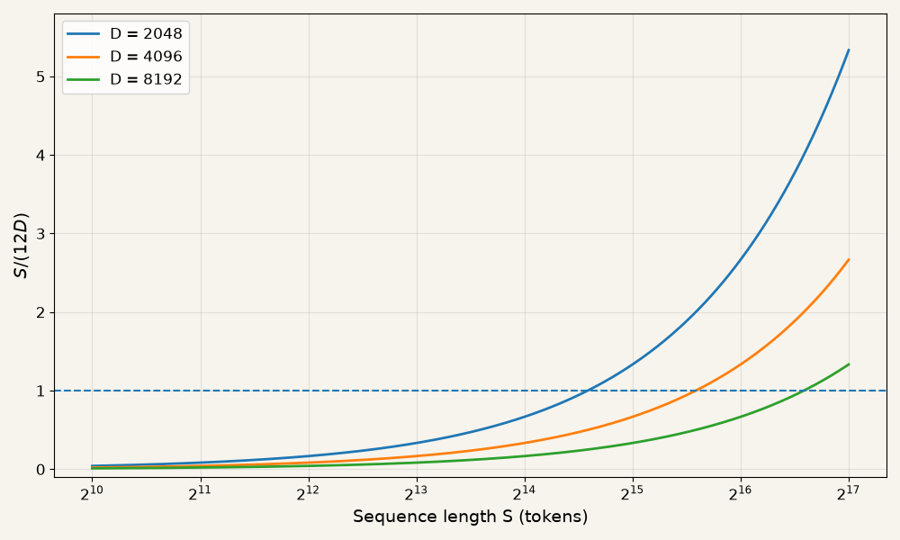

In this writeup, we'll calculate the number of FLOPs performed during a Transformer forward pass over a single sequence of $S$ tokens. Our treatment here closely follows the [Transformer Accounting](https://jax-ml.github.io/scaling-book/transformers/) chapter of the Scaling book, but focuses on the forward pass and uses a simpler architecture. ^[We consider vanilla MHA, not GQA; we also assume vanilla FFN, rather than gating einsum.] In case you need to brush up on Transformer details, please refer to [this blog post](https://jalammar.github.io/illustrated-transformer/) and [this book chapter](https://web.stanford.edu/~jurafsky/slp3/7.pdf).

## Preliminaries

1. Dot product $x[P].y[P]$ needs $P$ multiplies and $P - 1$ additions; hence we do $2P - 1$ FLOPs in total. We can approximate this as $2P$ FLOPs when $P$ is large; henceforth, we'll assume this.

2. A matrix-vector product $A[N, P]x[P]$ involves doing $N$ dot products - one per row of A. In total, $2NP$ FLOPs are needed.

3. A matrix-matrix product $A[N, P]B[P, M]$ gives an output of shape $[N, M]$. Element $(i, j)$ is obtained by doing a dot product between the $i$-th row of $A$ and the $j$-th column of $B$. In total, we do $2NPM$ FLOPs. We say that $P$ is the *contracting* dimension, since we sum up over this dimension when doing the dot product. This gives us a useful rule of thumb:

\begin{equation}
[N, P] \times [P, M] \to [N, M]: 2NPM \text{ FLOPs}.
\end{equation}

4. Sometimes we repeat an operation independently for every element of some dimension. For example, consider multiplying two tensors $A[K, N, P]$ and $B[K, P, M]$ in the following manner
\begin{equation}
out(k, n, m) = \sum_{p} A[k, n, p]B[k, p, m].
\end{equation}
In this case, the total FLOP count is $K$ times $2NPM$, that is, $2KNPM$ FLOPs. 

::: {.intro-figure}
.](transformer_arch.png){width=99%}
:::

## FLOPs and Parameter Counts 

We'll calculate FLOPs for a forward pass through one Transformer layer and multiply that value by $L$, the number of layers in the model. We also need to account for the embedding and unembedding operations at the very start and end respectively.

As a first approximation, we can the contribution of ReLU, layer normalization, and softmax to the total FLOPs count. These operations require relatively few FLOPs per element, so their contribution is much smaller than that of tensor multiplications.

### MLPs
\begin{array}{ccc}
\textrm{operation} & \textrm{FLOPs} & \textrm{params} \\
\hline \\

A[S,D] \cdot W_{\mathrm{in}}[D,F]
    & 2SDF & DF \\[10pt]

A[S,F] \cdot W_{\mathrm{out}}[F,D]
    & 2SDF & DF \\[10pt]

\hline \\
& 4SDF & 2DF
\end{array}

### Attention 

#### Linear Projections
\begin{array}{ccc}
\textrm{operation} & \textrm{FLOPs} & \textrm{params} \\
\hline \\

A[S,D] \cdot W_Q[D,N,H]
    & 2SDNH & DNH \\[10pt]

A[S,D] \cdot W_K[D,N,H]
    & 2SDNH & DNH \\[10pt]

A[S,D] \cdot W_V[D,N,H]
    & 2SDNH & DNH \\[10pt]

A[S,N,H] \cdot W_O[N,H,D]
    & 2SDNH & DNH \\[10pt]

\hline \\
& 8SDNH & 4DNH
\end{array}

#### Scaled Dot product Attention (SDPA)
SDPA involves repeating the SH.HS matmul over $N$ heads to get similarity scores, and then repeating the SS.SH matmul over the $N$ heads to get attention-weighted values. 

\begin{array}{cc}
\textrm{operation} & \textrm{FLOPs} \\
\hline \\[3pt]

Q[S,N,H] \cdot K[S,N,H]
    & 2{S^2}NH \\[3pt]

A[S,S,N] \cdot V[S,N,H]
    & 2S^2NH \\[3pt]

\hline \\
& \approx 4S^2NH
\end{array}

### Other Operations
It remains for us to consider the embedding and unembedding layers. 

Conceptually, embedding a token is equivalent to multiplying its $V$-dimensional one-hot representation by a $[V, D]$ embedding matrix. In practice, this is implemented as a lookup of the appropriate row of the embedding matrix. This involves only a memory operation and no arithmetic.

The unembedding layer, coming after the last Transformer layer, does involve a significant number of FLOPs:

\begin{array}{ccc}
\textrm{operation} & \textrm{FLOPs} & \textrm{params} \\
\hline \\
A[S,D] \cdot W_{\mathrm{unembed}}[D,V]
    & 2SDV & DV
\end{array}

### SDPA vs Matmul FLOPs

For our analysis, we are going to assume $NH = D$ and $F = 4D$ - this is very commonly the case in Transformers. Summing up SDPA FLOPs over all layers, we get:

\begin{equation}
\text{Total SDPA FLOPs} = 4S^2NHL = 4S^2DL
\end{equation}

Summing up the matmul FLOPs over all layers (not including unembedding layer):

\begin{equation}
\text{Total matmul FLOPs} = (4SDF + 8SDNH)L = 24SD^2L
\end{equation}

The ratio of SDPA FLOPs to all matmul FLOPs (including attention projections) is:

\begin{equation}
\frac{\text{SDPA FLOPs}}{\text{matmul FLOPs}} = \frac{4S^2D}{24SD^2} = \frac{S}{6D}
\end{equation}

Plotting this ratio for typical values of D gives

::: {.intro-figure}
{width=70%}
:::

From the plot we observe that the SDPA FLOPs dominate the matmul FLOPs at longer context lengths. The crossover happens at sequence lengths ~12k, ~24k, and ~49k for embedding dimensions 2k, 4k, and 8k respectively. Larger models tend to have larger embedding dimensions.

### General Rule of Thumb for Transformer Inference FLOPs

The total number of parameters is approximately
\begin{equation}
\text{Parameter count} = (2DF + 4DNH)L = 12D^2L
\end{equation}

For the short-context regime ($S << 6D$), the quadratic SDPA FLOPs are small relative to matmul FLOPs. Ignoring lower-order operations like layer norm, ReLU, softmax, we arrive at the useful thumb rule:
\begin{equation}
\text{Forward-pass FLOPs} = 2 \times \text{num tokens } \times \text{ parameter count}
\end{equation}
(Unembedding matmul with $2SDV$ FLOPs and $DV$ parameters also follows the same thumb rule.)

In effect, each weight parameter participates in one multiply and one add (that is, one fused-multiply-add) per token.

